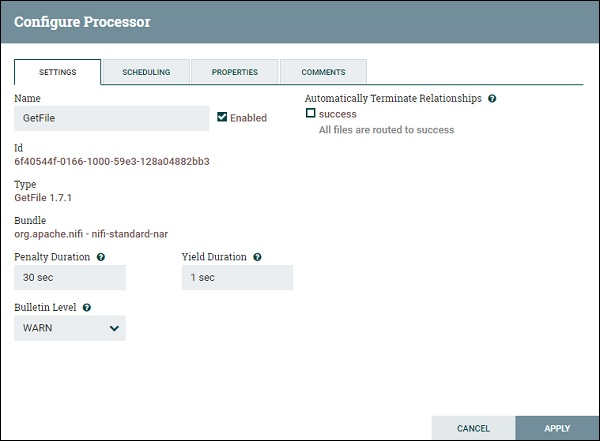

<!-- General qustions -->
## What is `Apache NiFi`?
* Apache NiFi is a software project from the Apache Software Foundation designed to automate the flow of data between software systems.
  
## NIFI
* National Issues Forums Institute.
* National Inland Fisheries Institute 
* (Fisheries Department, Bangkok, Thailand)

## Is Apache NIFI an *ETL* tool?
> Apache NiFi is an integrated data logistics platform   for automating the movement of data between disparate systems.
*  It is not an interactive ETL tool. 
*  It can be part of an ETL solution.

## NIFI & KAFKA
|--- |--- |  
|NIFI |KAFKA |  
|NiFi is primarily a data flow tool|Kafka is a broker for a pub/sub type of use pattern.|  

## How much data can NIFI handel?
* NiFi handles the data at an impressive rate of 9.56 TB  per 5 minutes
* 42.4 billion messages in 5 minites
* 32.6 GB/sec

## What is NIFI in **Big Data?**
* It provides real-time control that makes it easy to manage the movement of data between any source and any destination.

## Does NIFI need *Zookeeper* ?
* zookeeper is a fundamental part of the NiFi cluster.
* It is used to automatically determine the cluster coordinator as well as communication within the cluster.
* if you do not want to use zookeeper then you will have to use a 0.x baseline version of NiFi.
## How do i **start** NIFI?
* From a terminal window, navigate to the NiFi installation directory.
> ` bin/nifi.sh start`
## How do i stop NIFI?
* From a terminal window, navigate to the NiFi installation directory.
> `bin/nifi.sh stop`
<!-- Features -->
## NiFi- General Features
* web based user interface
* Highly configurable
    * guaranteed delivery, 
    * low latency, 
    * high throughput, 
    * dynamic prioritization, 
    * back pressure
    *  modify flows on runtime.
* data provenance module
    * track and moniter data
* create custom process and reporting
* Secure Protocals
  * SSL
  * HTTPS
  * SSH
  * other encriptions
* user and role managment
  * configure LDAP for authorization
<!-- Concepts -->
## Key concepts
* Process group
  - group of NIFI Flows 
* Flow
  - contain different processors 
* Processor
  - java module
  - add attribute or change content in flowfile
* Flowfile
  - single object
  -  CREATE, CLONE, RECEIVE, etc.
* Event
  - tracked in data provenance
* Data provenance
  - repository
  - UI
  - troubleshooting issues

## NiFi Advantages
* remote data fetching using SETP
* support clustering
  - same flow, different data
  - increases performence
* security policy on  
  - user level
  - process group
  - modules
- UI can run on HTTPS
- supports `188` processors 
- custom plugin
  
## NiFi Disadvantages
- when node disconnects from **NiFi** then the user changes on **flow.xml** is invalid.
- A node cannot connect back unless **file.xml** is copied from connected node.
- state persistent issue 

##  NiFi - Basic Concepts
![Apache Web Server]./images/(apache_web_server.jpg)
- Flowfile Repository
- Content Repository
- Provenance Repository

### Flowfile Repository

- stores 
  - state 
  - attributes
- default location
  - root of apache NiFi
- modefy location of repositery 
  > nifi.flowfile.repository.directory

### Content Repository
- change repositery 
  > org.apache.nifi.controller.repository.
>it is advisable to have enough space in the installation disk.

### Provenance Repository
- tracks and stores all the events
- two type
  - volatile provenance repository
    - data get lost after restart
      > org.apache.nifi.provenance.VolatileProvenanceRepositor
  - persistent provenance repository.
     > org.apache.nifi.provenance.PersistentProvenanceRepository

<!-- SetUp -->
---
## Environment Setup
- unix | linux
  - step 1
    - > java -version
    - > $ echo $JAVA_HOME
  - step 2
    - windows download ZIP
    - unix download TAR
    - docker image [link](https://hub.docker.com/r/apache/nifi/)
  - step 3
      - unix 
      - > $tar -xvf nifi-1.6.0-bin.tar.gz
      -  windows extract zip
   - step 4
     - exicute `run-nifi.bat`
     - > C:\nifi-1.7.1\bin>run-nifi.bat
   - step 5
     - UI
     - `http://localhost:8080/nifi/`
---
<!-- UI -->
## NiFi UI
- user attributes
   - Active Threads
   - Total queued data
   - Transmitting Remote Process Groups
   - Not Transmitting Remote Process Groups
   - Running Components
   - Stopped Components
   - Invalid Components
   - Disabled Components
   - Up to date Versioned Process Groups
   - Locally modified Versioned Process Groups
   - Stale Versioned Process Groups
   - Locally modified and Stale Versioned Process Groups
   - Sync failure Versioned Process Groups

###  Web UI

<!-- Components of Apache NiFi -->
## Components of Apache NiFi
- *Processors*
  - User can drag the process icon on the canvas and select the desired processor for the data flow in NiFi.
   
- *Input port*
  - Below icon is dragged to canvas to add the input port into any data flow.
  

Input port is used to get data from the processor, which is not present in that process group.
  - 
- *Output port*
  - The below icon is dragged to canvas to add the output port into any data flow.

   
- *Process Group*  

   
- *Remote Process Group*
    
- *Funnel*
  - Funnel is used to transfer the output of a processor to multiple processors  
  
  
- *Template*
  - This helps to reuse the data flow in the same or different NiFi instances.
  
- *Label*
  - add text on NiFi canvas
  
---
<!-- Processors -->
##  Processors
- basic block to create data flow
- Ex: 
  - etching file from one directory using GetFile processor and storing it in another directory using PutFile processor.
    

- **GetFile**
  - fetch files of a specific format from a specific directory
  
    ### GetFile Settings
      - Name
      - Enable (enable or disable the processor)
      - Penalty Duration (in the event of flowfile failure)
      - Yield Duration (yield time for processor. In this duration, the process is not scheduled again.)
      - Bulletin Level ( log level of that processor)
      - Automatically Terminate Relationships 
        - list of check of all the available relationship 
        - user can program processor to terminate the flowfile
        - 

### GetFile Scheduling
- Schedule Strategy 
  - time driven
  - CRON driver
- Concurrent Tasks
- Execution
  - all nodes
  - Primary node
- Run Schedule
  

### GetFile Properties

`* Input directory and file filte`
### GetFile Comments
- specify any information about processor.

## PutFile

### PutFile Settings
same as **GetFile**
### PutFile Settings

### PutFile Scheduling

### PutFile Properties

<!-- Categorization -->
---
## Processors Categorization
  ### Data Ingestion Processors
    - starting point of any data flow
    - GetFile, GetHTTP, GetFTP, GetKAFKA, etc.

  ### Routing and Mediation Processors
  - route the flowfiles to different processors or data flows
    > RouteOnAttribute, RouteOnContent, ControlRate, RouteText, etc
  ### Database Access Processors
  - selecting or inserting data or executing and preparing other SQL statements 
  - use data connection pool controller setting
  > ExecuteSQL, PutSQL, PutDatabaseRecord, ListDatabaseTables, etc.
  ### Attribute Extraction Processors
  -  extract, analyze, change flowfile attributes
  -  UpdateAttribute, EvaluateJSONPath, ExtractText, AttributesToJSON, etc.
  ### System Interaction Processors
  -  run processes or commands
  -  run scripts in many languages
  > ExecuteScript, ExecuteProcess, ExecuteGroovyScript, ExecuteStreamCommand, etc.
  ### Data Transformation Processors
  - altering content of the flowfiles
  - fully replace the data of a flowfile (send flowfile as an HTTP body to invokeHTTP processor)
  > ReplaceText, JoltTransformJSON
  ### Sending Data Processors
  - end processor in a data flow.
  - send data to the destination server
  - (on complition) DROP the flowfile with success relationship
  > PutEmail, PutKafka, PutSFTP, PutFile, PutFTP, etc.
  ### Splitting and Aggregation Processors
  - split and merge the content present in a flowfile
  > SplitText, SplitJson, SplitXml, MergeContent, SplitContent, etc.
  ### HTTP Processors
  - HTTP and HTTPS calls
  > InvokeHTTP, PostHTTP, ListenHTTP, etc.
  ### AWS Processors
> GetSQS, PutSNS, PutS3Object, FetchS3Object, etc.
---
<!-- Relationship -->
  ## Processors Relationship

  ### Success
  When a processor **successfully** processes a flowfile like *store* or *fetch* data from any datasource **without getting any connection, authentication or any other error**, then the flowfile goes to *success relationship.*
  ### Failure
  - when process encounters **authentication error or connection problem** 
  - flowfile can be transfered to other process using connection
  - we can select or loadbalance
  
    - connection marked in red have failure relationship
    - process without errors will be transferred to the connection marked in green
  ### comms.failure
  - when a Flowfile could not be fetched from the remote server due to a communications failure.

  ### not.found
  - ‘Not Found’ *message* marked as **not.found** 

  ### permission.denied
  - **insufficient permission**

  ### FlowFile
  - data connections and attribute
    
  * **mime.type**
    - It specifies the MIME Type of this FlowFile.
  <!--  Queues -->
  ---
  ##  Queues
  
  - List queue(view)
  -  empty queue(clear)
  -  restart
     
      > **info icon**, position, UUID, Filename, File size, Queue Duration, and Lineage Duration
      - click on `icon info` to view more details.
   <!-- Process Groups -->
   ## Process Groups
   
   > NiFi FileFlow >> process_group >> peocess_group_1
   - List all process groups (summarey on top left)
      > parameters like Version State, Transferred/Size, In/Size, Read/Write, Out/Size

   
<!-- Labels -->
  ## Labels 
  - The leftmost icon in the top menu of NiFi UI
  <!-- Configuration -->
  ## Configuration
  >  nifi.properties file in conf directory

  ### Core properties
  |name|value|description|
  |---|---|---|
  |nifi.flow.configuration.file|./conf/flow.xml.gz|* path to flow.xml file  * all data files created in NiFi |
  |nifi.flow.configuration.archive.enabled|	true | enable or disable archive|
  |nifi.flow.configuration.archive.dir|./conf/archive/|archive directory|
  |nifi.flow.configuration.archive.max.time|30 days | retention time for archiving|
  |nifi.flow.configuration.archive.max.storage	| 500 MB |maximum size of archiving directory can grow|
  |nifi.authorizer.configuration.file	|./conf/authorizers.xml|authorizer configuration file,used for user authorization|
  |nifi.login.identity.provider.configuration.file	|./conf/login-identity-providers.xml|configuration of login|
  | nifi.templates.directory	|./conf/templates	|directrey where templets will be stored|
  |nifi.nar.library.directory	|./lib|NAR files|
  |nifi.nar.working.directory|./work/nar/|unpacked NAR files|
  |nifi.documentation.working.directory	|./work/docs/components	|documentation of all components|

  ---
